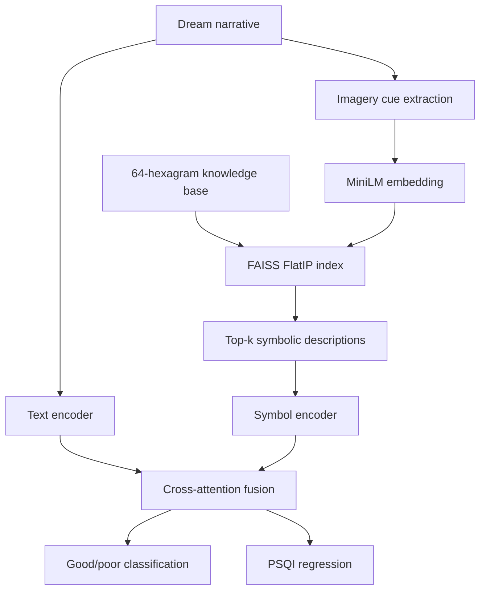

# Symbolic Dream RAG

Reference implementation for **“Integrating Symbolic Cultural Knowledge into Neural Dream Understanding: A Retrieval-Augmented Approach”** (CAICE 2026, DOI: `10.1145/3804601.3804625`).

The project links dream narratives to an external I Ching knowledge base, retrieves the top-*k* symbolic entries with `all-MiniLM-L6-v2` and FAISS, fuses dream and symbolic representations with cross-attention, and jointly predicts:

- binary sleep quality (`good` / `poor`);
- continuous Pittsburgh Sleep Quality Index (PSQI), from 0 to 21.

> This repository is a clean reference implementation reconstructed from the published methodology. The included 400-record dataset is **synthetic demonstration data**, not the original participant dataset and not clinical data. Do not use this project for diagnosis.

## Pipeline



## Repository layout

```text
configs/paper.yaml                  paper-aligned hyperparameters
data/hexagrams.json                 64-hexagram base knowledge
data/cue_grounding.json             auditable cue-to-symbol anchors
data/synthetic_dreams.jsonl         generated 400-record demo corpus
scripts/generate_synthetic_dataset.py
scripts/prepare_retrieval.py
src/symbolic_dream_rag/dataset.py
src/symbolic_dream_rag/retriever.py
src/symbolic_dream_rag/model.py
src/symbolic_dream_rag/train.py
src/symbolic_dream_rag/evaluate.py
src/symbolic_dream_rag/predict.py
tests/
```

## Data schema

Each JSONL record contains:

| Field | Meaning |
|---|---|
| `dream_id` | anonymous record ID |
| `split` | `train`, `dev`, or `test` |
| `dream_text` | free-form dream narrative |
| `imagery_spans` | evidence spans copied from the narrative |
| `imagery_labels` | normalized culture-agnostic cues |
| `hexagram_ids` | one to three annotation targets |
| `psqi_score` | integer in `[0, 21]` |
| `sleep_label` | `0` for good (`PSQI <= 5`), otherwise `1` |
| `reference_explanation` | short evidence-grounded explanation |
| `synthetic` | always `true` in the included demo corpus |

The generated split exactly follows the paper: 280 train, 40 development, and 80 test records, balanced between good and poor sleep in every split.

## Quick start

```bash
python -m venv .venv
source .venv/bin/activate
pip install -r requirements.txt

python scripts/generate_synthetic_dataset.py
python scripts/prepare_retrieval.py \
  --input data/synthetic_dreams.jsonl \
  --output data/synthetic_dreams_retrieved.jsonl \
  --top-k 5

python -m symbolic_dream_rag.train \
  --config configs/paper.yaml \
  --data data/synthetic_dreams_retrieved.jsonl \
  --output-dir runs/full

python -m symbolic_dream_rag.evaluate \
  --checkpoint runs/full/best.pt \
  --data data/synthetic_dreams_retrieved.jsonl \
  --split test
```

Run a single prediction:

```bash
python -m symbolic_dream_rag.predict \
  --checkpoint runs/full/best.pt \
  --text "I was lost on a flooded road in the dark."
```

## Paper-aligned settings

- sentence embedding: `sentence-transformers/all-MiniLM-L6-v2`;
- dense retrieval: normalized embeddings with `faiss.IndexFlatIP`;
- retrieval depth: `k = 5`;
- training: 30 epochs, AdamW, learning rate `1e-5`, cosine decay;
- multi-task objective: binary cross-entropy plus PSQI regression loss, `alpha = 1`;
- classification metrics: accuracy and macro-F1;
- regression metrics: RMSE and MAE;
- explanation metrics: BLEU-4 and ROUGE-L.

The `--mode` option supports `full`, `text_only`, `retrieval_only`, and `symbolic_only` experiments. Retrieval-depth studies can be run by regenerating the retrieval file with `--top-k 1`, `3`, `5`, or `7`.

## Reproducibility notes

The paper reports results from the original annotated corpus. Metrics obtained from the synthetic demo corpus are pipeline checks and must not be presented as reproductions of the paper's reported numbers. To use authorized original data, convert it to the documented schema and keep participant text outside public version control unless consent and ethics requirements permit release.

## Knowledge-base attribution

The base number/name/pinyin/English-title fields in `data/hexagrams.json` are adapted from [`FENGTING2025/iching-64-hexagrams-json`](https://github.com/FENGTING2025/iching-64-hexagrams-json), released under the MIT License. Cue mappings and retrieval descriptions in this repository are authored for this research pipeline and should be treated as modeling annotations rather than universal interpretations.

## License

Code is released under the MIT License. See `NOTICE` for third-party data attribution.
